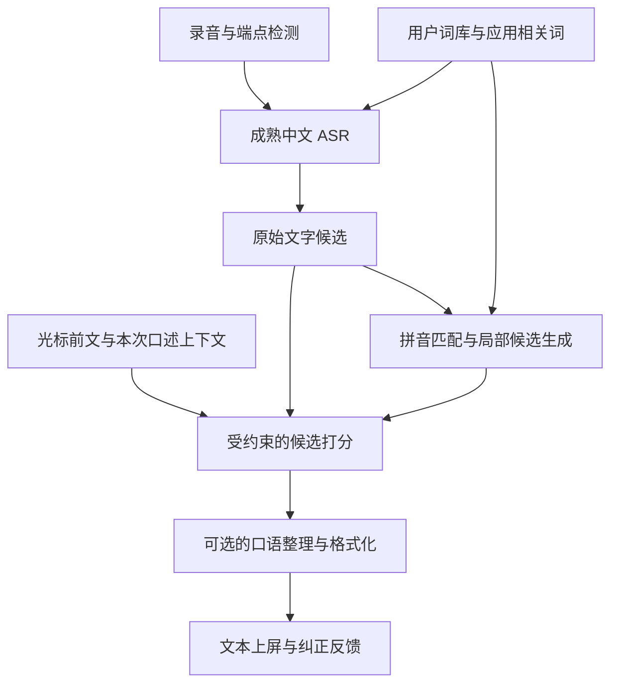

# 中文语音输入法：拼音中间层的可行性与模型选择

调研日期：2026-09-15。目标是类似 Typeless 的语音输入体验，重点解决中文人名、项目名、专业词和个人表达的识别问题。

本文基于官方仓库、模型卡、论文和源码核查；没有使用用户录音进行端到端实测。模型性能数字标明原始评测条件，不代表本项目可以达到的结果。部署偏好尚未确定，因此同时考虑本地和服务端。

后续已完成 M4 本地小规模实验，结果和可运行入口见 [本地实验报告](local-pilot-results.md) 与 [README](../README.md)。本地数据包含合成音频和一条公开示例，仍未包含用户录音。

## 1. 结论

**方案可行。最值得保留的是“发音约束＋可更新词库＋上下文打分”的能力。第一版建议保留成熟 ASR 的汉字结果，通过拼音补充纠错候选；直接训练音频到拼音的模型作为第二阶段。**

这不是一个尚无先例的方向。2021 年的 [Decoupling recognition and transcription in Mandarin ASR](https://arxiv.org/abs/2108.01129) 已经研究音频→拼音→汉字，报告 AISHELL-1 上 3.9% CER。它证明当时的实验设置下该结构有效，不能据此判断优于今天的大规模 ASR。

2025 年的 [Pinyin-Guided Chinese Speech Recognition with Large Language Model](https://www.isca-archive.org/interspeech_2025/zhengjie25_interspeech.pdf) 同时生成拼音与汉字，再用拼音筛选上下文热词，和本项目设想很接近。该论文在自己的 AISHELL-1 设置下报告整体 CER 相对降低 25%，热词部分相对降低 49.2%；这些收益不能直接外推到 Qwen3-ASR、Fun-ASR-Nano 或真实口述。

### 三种不同的实现

| 实现 | 能解决什么 | 限制 | 建议 |
|---|---|---|---|
| 音频→ASR 汉字→拼音→词库纠错 | 同音词、专名、术语的定向替换 | 拼音来自已经识别出的字，无法恢复被丢弃的声学信息 | 第一版，保留原文候选，只做局部纠错 |
| 音频→多条文字/发音候选→词库与 LM 联合选择 | 同音和部分近音错误，保留更多不确定性 | 需要解码器暴露候选和分数；普通转写 API 不一定提供 | 第二步，通常比更换声学模型便宜 |
| 音频→拼音/音素概率→词库解码→汉字 | 最完整地实现可插拔输入法解码 | 现成普通话拼音模型的产品成熟度不足，需要训练或适配 | 专项研发路线 |

如果只是让已有 STT 结果显示拼音，使用 [python-pinyin](https://github.com/mozillazg/python-pinyin) 一类文本工具即可，不需要另一个语音模型。它提供的是文字读音，不是对原始录音的重新识别。

## 2. qingjian 实际提供了什么

核查源码版本：[30bf66ce49080df571273bf944d75f87a4195271](https://github.com/qingjian-team/qingjian/tree/30bf66ce49080df571273bf944d75f87a4195271)。

### 2.1 转换引擎和神经模型是两部分

转换过程可以概括为：

```text
拼音解析、模糊音与拼写变体
          ↓
基础词库＋用户词库构建词图
          ↓
二元语言模型＋个人使用统计，搜索若干汉字路径
          ↓
小型字级 Transformer 根据前文给路径重打分
```

神经模型本身输入“前文＋汉字候选”，输出候选的语言模型分数。它没有读取音频，也不独立承担全部拼音到汉字转换。实现是 Rust/Candle，GPT-2 风格的字级 decoder-only Transformer。[模型接口](https://github.com/qingjian-team/qingjian/blob/30bf66ce49080df571273bf944d75f87a4195271/crates/qingjian-neural/src/lib.rs)、[打分适配](https://github.com/qingjian-team/qingjian/blob/30bf66ce49080df571273bf944d75f87a4195271/crates/qingjian-neural/src/core_scorer.rs)

项目实验记录列出 small 23M 和 base 36M 两档，训练代码在私有的配套仓库。当前公开 data release 有约 56 MB 的 `model.qjm`。实验型号参数量和发布包大小分别来自不同材料，不能用其中一个推算另一个版本的精确结构。[实验记录](https://github.com/qingjian-team/qingjian/blob/30bf66ce49080df571273bf944d75f87a4195271/docs/notes/neural-rescoring.md)、[发布数据](https://github.com/qingjian-team/qingjian/releases/tag/data)

### 2.2 已经存在一个有用的接入点

`sentence::convert_paths` 接收：

- `positions`：每个音节位置可以有多个拼音候选。
- `cost(position, syllable)`：选择某个读音时的代价。
- 多本词典、语言模型、个人统计。
- 返回多条汉字候选路径，用于后续重打分。

这允许把一部分语音候选及代价适配进去。现有结构按固定音节位置展开，仍不是能直接接收逐帧 CTC 概率的语音解码器；不同长度的假设、音节插入删除和路径相关性需要另行处理。[Viterbi 接口与实现](https://github.com/qingjian-team/qingjian/blob/30bf66ce49080df571273bf944d75f87a4195271/crates/qingjian-core/src/sentence/viterbi.rs)

候选搜索还有剪枝：当前束宽为 8，默认重排只看少量路径。语音存在更多歧义，不能直接假设键盘输入场景的候选宽度足够。正确词如果在前面的词图搜索中被丢弃，后面的神经模型就没有机会选中它。[搜索常量](https://github.com/qingjian-team/qingjian/blob/30bf66ce49080df571273bf944d75f87a4195271/crates/qingjian-core/src/sentence/mod.rs)、[架构](https://github.com/qingjian-team/qingjian/blob/30bf66ce49080df571273bf944d75f87a4195271/docs/design/architecture.md)

### 2.3 如何看待它的效果和延迟

作者使用 8,322 条技术文档及笔记短句，先转换成拼音再还原文字。该冷启动测试的整句首选准确率由 37.6% 提升到 41.9%；这是拼音输入法测试，不是录音识别准确率。

缓存优化后的 M1/Metal 重排记录是：64 字前文、8 个候选约 28 ms。这个结果支持“小模型重排可能足够轻”的判断，不代表整条 STT 链路仅需 28 ms。[作者评测与优化记录](https://github.com/qingjian-team/qingjian/blob/30bf66ce49080df571273bf944d75f87a4195271/docs/notes/neural-rescoring.md)

### 2.4 复用条件

代码使用 GPL-3.0-or-later。较早的评测笔记仍写权重许可待定，但 9 月 12 日后的打包脚本已明确把模型权重也标记为 GPL-3.0-or-later；应采用这个较新的明确声明。词库和语料另外有各自的来源许可。[Cargo 元数据](https://github.com/qingjian-team/qingjian/blob/30bf66ce49080df571273bf944d75f87a4195271/Cargo.toml)、[权重打包声明](https://github.com/qingjian-team/qingjian/blob/30bf66ce49080df571273bf944d75f87a4195271/tools/release/pack-model.sh)、[数据来源](https://github.com/qingjian-team/qingjian/blob/30bf66ce49080df571273bf944d75f87a4195271/docs/design/landscape.md)

因此适合做研究原型和评估复用。如果未来采用闭源分发，需要把许可作为选型条件。另一条可评估路线是 [librime 的 BSD 核心](https://github.com/rime/librime/blob/master/LICENSE) 配合许可明确的词库和独立训练的打分模型；前端、插件、词库的许可仍需分别看。

## 3. 直接输出拼音或音素的现成模型

| 候选 | 实际输出/能力 | 适用性判断 |
|---|---|---|
| [ASRT](https://github.com/nl8590687/ASRT_SpeechRecognition) | DCNN＋CTC，音频直接输出汉语拼音；模型包含在其发布包中 | 最直观的端到端拼接实验。README 限制单段最长 16 秒，自报约 85% 拼音正确率；不宜据此作为高精度产品默认模型 |
| [snu-nia-12/wav2vec2-large-xlsr-53_nia12_phone-pinyin_chinese](https://huggingface.co/snu-nia-12/wav2vec2-large-xlsr-53_nia12_phone-pinyin_chinese) | Wav2Vec2ForCTC，218 个输出符号，包含声母和带声调韵母，例如 `n`、`i3` | 更贴近“独立声学概率→拼音”实验；需把音素组装成合法音节。缺完整模型卡、评测和明确许可，生产选型证据不足 |
| [Charsiu](https://github.com/lingjzhu/charsiu) 的 `zh_xlsr_fc_10ms` | 文档提供 `charsiu_predictive_aligner` 的普通话无文本音素预测；区别于需要文本的 forced aligner | 适合探索发音证据和时间边界；输出是音素及区间，不是即用的拼音输入法 API，产品 CER 和延迟需要另测 |
| [TencentGameMate/chinese-hubert-base](https://huggingface.co/TencentGameMate/chinese-hubert-base)＋新 CTC 输出层 | 原模型只抽取声学特征，没有现成拼音识别头；模型卡说明需要有标签微调 | 自训拼音识别器的合理起点。使用中文预训练编码器，微调到拼音标签，无需从零做声学预训练；原模型不原生支持流式 |

snu-nia 模型的能力判断核查了实际 [config.json](https://huggingface.co/snu-nia-12/wav2vec2-large-xlsr-53_nia12_phone-pinyin_chinese/blob/main/config.json) 和 [vocab.json](https://huggingface.co/snu-nia-12/wav2vec2-large-xlsr-53_nia12_phone-pinyin_chinese/blob/main/vocab.json)，不是仅凭名称判断。

另外搜到 `AngelOnFira/wav2vec2-base-common-voice-pinyin`，但其[模型卡](https://huggingface.co/AngelOnFira/wav2vec2-base-common-voice-pinyin)自报 WER=1.0，不能当成可用精度的依据。

**如果要挑一个做“现成音频→拼音”的小实验，可先看 ASRT；如果要做长期产品，优先保留成熟 ASR，并把自训中文 CTC 拼音分支作为后续候选。**

## 4. 更适合第一版语音输入法的 ASR 选择

以下推荐是根据接口、部署路径与目标任务作出的工程判断，不是本机实测排名。这些模型的标准输出都是文字，并非原生拼音候选网。

| 模型 | 选择理由 | 对本项目的限制与角色 |
|---|---|---|
| **[Qwen3-ASR-0.6B / 1.7B](https://github.com/QwenLM/Qwen3-ASR)** | 提供上下文提示接口，支持中英等语言；权重模型卡为 Apache-2.0 | 0.6B 型号作为第一版通用基线；1.7B 做准确率对照或服务端版本。高层 API 未直接提供拼音 lattice 或 N-best 分数 |
| **[Fun-ASR-Nano-2512](https://github.com/QwenAudio/Fun-ASR)** | 官方标注 800M；中文、英文、日文与中文方言/口音；示例支持 `hotwords`；有 GGUF 本地部署路径 | 和 Qwen 组成首轮二选一，重点比较术语命中率。热词通过提示进入模型，不能视为必选词或严格约束 |
| **[SenseVoiceSmall](https://github.com/QwenAudio/SenseVoice)** | 约 234M；非自回归；ONNX 部署方便，代码中能拿到 CTC 输出 | 内存/CPU 开销敏感时的基线，也适合研究 CTC 文字候选。它本身不是原生流式拼音模型 |
| **[Paraformer-zh-streaming](https://github.com/modelscope/FunASR)** | 官方标注 220M，有音频分块与状态缓存接口 | 需要边说边显示时作为预览候选。流式 checkpoint 与离线热词 checkpoint 的能力应分别验证 |
| [FireRedASR2-AED](https://github.com/FireRedTeam/FireRedASR2S) | 中文/中英混说的精度对照，官方支持时间戳与置信分 | 适合离线最终识别的备选；项目包含 streaming VAD，不代表 ASR 本体就是原生流式 |

### 部署细节

- **Mac 本地**：Qwen 有社区维护的 [qwen3-asr-mlx](https://github.com/gabrimatic/qwen3-asr-mlx)。其接口支持 `context`，应把它视为单独需要验证的运行时。Qwen 官方仓库当前声明流式接口使用 vLLM，不能把官方服务端流式支持直接等同于这个 Mac 实现支持。
- **Linux/GPU 服务端**：先采用官方推理路径，减少端侧转换带来的变量。Qwen 的[官方示例](https://github.com/QwenLM/Qwen3-ASR/blob/main/examples/example_qwen3_asr_transformers.py)展示上下文输入；[结果类型](https://github.com/QwenLM/Qwen3-ASR/blob/main/qwen_asr/inference/qwen3_asr.py)主要是 language、text 和可选时间戳，更多候选/分数需要额外开发。
- **Fun-ASR-Nano 的实时接口**：其 [vLLM 指南](https://github.com/QwenAudio/Fun-ASR/blob/main/docs/vllm_guide.md)描述 720 ms 分块、累计重编码。可以展示实时结果，但计算成本不能按固定成本的增量编码器估算。
- **SenseVoice 的词库增强**：代码中的 [CTC log_softmax](https://github.com/QwenAudio/SenseVoice/blob/main/model.py)可作为自定义解码的入口；不能因为接上 sherpa-onnx 就假定已有全部热词功能。[所查热词教程](https://k2-fsa.github.io/sherpa/onnx/hotwords/index.html)限定 transducer 与 `modified_beam_search`。
- **模型大小与许可**：型号里的 B/M 不能替代整个 checkpoint 的磁盘大小和进程峰值内存。SenseVoiceSmall 的[权重模型卡](https://huggingface.co/FunAudioLLM/SenseVoiceSmall)链接单独的 FunASR MODEL_LICENSE；不能用推理代码的 MIT 许可替代权重许可。

## 5. 推荐的系统结构

### 5.1 第一版：保留 ASR 原文，增加拼音候选纠错



具体建议：

1. 使用 Qwen3-ASR-0.6B 跑通基线，同一批录音比较 Fun-ASR-Nano-2512。先按按键结束后定稿的交互实现；若产品要求实时预览，再引入相应的流式运行时。
2. 从词库中筛选本次相关的少量词作为 ASR 上下文/热词。整本几十万条词典应留在本地索引中，不作为长提示全部送进 ASR。
3. 对识别文本的中文片段生成拼音，与词库做同音和有代价的近音匹配，产生局部替换候选。始终保留原始 ASR 结果作为竞争候选。
4. 候选打分同时考虑原结果的可信程度、拼音接近程度、前文和词库权重。没有 ASR 置信分时采用更保守的改动策略，不能伪造“声学置信度”。
5. 首轮可以只做字典匹配和简单上下文打分；再用 qingjian 的候选重排能力做对照，确认它是否实际带来净收益。

例如，用户词库中有项目“青简”，ASR 输出“接入清简”。两者读音一致，外部词库和上下文可以支持改成“接入青简”。如果 ASR 已经漏掉整个项目名，仅靠文字转拼音无法从声音中找回它。以上是机制示例，不是实测结果。

文本和拼音联合纠错本身也有研究依据：[PY-GEC](https://arxiv.org/abs/2409.13262)在单条 ASR 假设上使用拼音辅助，并通过合成错误和多任务训练增强纠错。因此，文字转拼音仍有实际价值，只是不能把它当成新增的声学观测。

### 5.2 第二版：保留发音候选及其分数

输出应接近下面的概念结构，而不是一条扁平字符串：

```text
片段起止时间
候选序列 A：qing1 jian3 shu1 ru4 fa3，声学分数 A
候选序列 B：qing3 jian3 shu1 ru4 fa3，声学分数 B
候选序列 C：……，声学分数 C
```

这些候选之间有时间和序列依赖。先用有限条完整假设实现适配比较简单；真正的 lattice 则保留多种路径和时间边界。不能只把每一帧的 top-3 音素独立拼起来当作合法语音候选。

概念上的目标是：

```text
总分 = 声学匹配分 + 上下文语言分 + 个人/领域词分 − 发音修改代价
```

各项权重需要验证集标定。端到端 ASR 的序列分数已包含语言先验，并非纯声学概率；与另一个 LM 组合时，要防止语言先验被重复加权。qingjian 将神经分替换部分静态二元分的实现值得参考。

### 5.3 拼音层必须适应语音

| 问题 | 应对方式 |
|---|---|
| 键盘拼错与语音误听的分布不同 | 使用 `n/l`、`zh/z`、`in/ing` 等真实混淆的统计代价；不要照搬相邻按键纠错权重，也不要无条件全部展开 |
| 输入法常用无声调拼音 | 匹配时可以忽略声调，内部仍保留有证据支持的声调候选；变调、轻声用软代价处理 |
| 多音字和专名 | 词级词典优先，允许用户指定读音；文字推导的声调不当作音频证据 |
| 不同音节数 | 允许插入、删除、合并与拆分假设，不能只做同长度替换 |
| 英文、数字、缩写 | 保留原始 token 和规范写法；词库支持发音别名，例如英文项目名的常见口述方式 |
| 高频词压过专名 | 领域词在候选生成时就加入，不能等重排时才注入；控制加权，防止把普通句子强行改成热词 |
| 正确答案不在前几条候选 | 测候选覆盖率，必要时扩大束宽/词图候选；先解决召回，再调大重排模型 |

已有字符 CTC 模型还可实验“同音字符的概率合并”为拼音候选，但这只是对字符后验的近似转换。多音字映射与模型原有语言偏好仍然存在，需要对照真正的拼音标签训练；不是免费得到一个新的纯声学模型。

## 6. 拼音到文字模型怎么选

| 方案 | 建议 |
|---|---|
| qingjian 词图＋统计 LM＋小型神经重排 | 最贴近当前构想的参考实现；适合验证可插拔词典和个性化；复用时考虑其许可与私有训练代码 |
| librime 核心＋合适词库 | 适合评估成熟输入法引擎；语音候选、发音代价和声调适配仍要开发，库自身的许可不代表全部数据许可 |
| 独立训练约 20–40M 的字级 LM | 对固定候选集合打分，方便控制延迟与领域语料；作为实验规模起点，不保证此规模就是最优 |
| [PinyinGPT / Transformers4IME](https://github.com/VisualJoyce/Transformers4IME) | 有直接面向拼音输入法的研究与权重。所查[权重卡](https://huggingface.co/aihijo/transformers4ime-pinyingpt-concat)标记 CC-BY-NC-SA-4.0，适合研究比较，不作为商业产品的默认依赖 |
| 通用指令 LLM | 更适合最后的口语整理；若承担识别纠错，应限制到候选或局部编辑，并检查专名、数字和否定词是否被改坏 |

## 7. 类似 Typeless 的体验，还需要什么

Typeless 官方把去口头禅、去重复、口述自我修正、自动格式化和个人词典列为能力。[产品介绍](https://www.typeless.com/)、[词典说明](https://www.typeless.com/help/quickstart/history-and-dictionary)

建议将两种目标分开评测：

- **识别层**：准确记录说了什么，修正同音词和术语。
- **整理层**：把“周三，不对，周四下午三点”整理为“周四下午三点”，处理列表、标点和口头重复。

第二种操作本来就会改变字面转写，不应该只用传统 CER 衡量。应检查最终意图、时间数字、专名和否定关系；同时保留可撤销的原始结果。词库匹配不能单独实现这一整套体验。以上是本项目架构建议，不代表已经知道 Typeless 内部使用了哪些模型。

个人学习应优先采用用户明确修正的词和读音，不要把所有自动接受的输出都当成正确标签反复强化。qingjian 自己的评测记录也展示了“用历史自动首选当真值”会如何偏向旧模型。

## 8. 最小验证方案

先收集约 300–500 条真实麦克风短句作为初始评测集，覆盖普通句子、中文专名、专业术语、中英混说、数字/日期、口音、口头自我修正、噪声和静音。这个规模用于发现方向性问题，不足以证明很低的误改率。

词库必须包含干扰项：不仅测“热词被说出来”，也要测“热词没有被说出来”和“另一个同音普通词确实被说出来”。调参集与最终测试集按录音会话或说话者分开。

### 第一轮对照

1. Qwen3-ASR-0.6B 原始结果。
2. Fun-ASR-Nano-2512 原始结果。
3. 两者分别加入相同来源、相同预算的上下文/热词。
4. 较优基线上加入局部拼音＋词库纠错。
5. 再加入 qingjian 风格 LM 重排。

这样能区分收益究竟来自换 ASR、提前加热词，还是后置拼音重排。

### 应记录的指标

| 指标 | 用途 |
|---|---|
| 中文 CER、中英混合错误率 | 确定整体识别是否改善 |
| 专名/术语精确命中率与误插入率 | 检查词库收益及过度偏置 |
| 改好数量、改坏数量、最终净错误变化 | 防止“纠错”实际伤害正确结果 |
| 候选中的正确答案覆盖率 | 判断需要改善候选生成，还是只需改善排序 |
| 停止说话到最终上屏的 P50/P95 | 反映用户实际等待，包含端点判断和全部后处理 |
| 首次加载、热启动、峰值内存 | 判断端侧常驻是否合适；不拿批量吞吐替代单次延迟 |
| 整理后意图与关键实体一致性 | 专门衡量 Typeless 式的口语整理 |

声学模型比较使用逐字人工转写；口语整理另有目标文本。拼音错误率区分带调/不带调，不能直接把 ASRT 的“拼音正确率”与汉字 CER 放在一张榜单上。

**推进条件：拼音层能提高真实术语命中率，并且整体 CER、误改率和上屏延迟满足产品目标。若候选经常缺失正确发音，再进入中文 HuBERT/Conformer/Zipformer 的拼音输出训练。**

## 最终建议

先用 **Qwen3-ASR-0.6B 作为基线，Fun-ASR-Nano-2512 作为中文热词对照，配合本地拼音词库和受约束重排**。qingjian 提供了值得复用或参考的后半段，但不能把它的几十 MB 小模型当作完整的高精度中文语音引擎。

长期最有价值的部分是用户词典、真实纠正反馈、发音混淆统计和应用上下文。把这些能力做成独立层，后续更换 ASR 或增加直接拼音声学分支时仍然可以保留。
